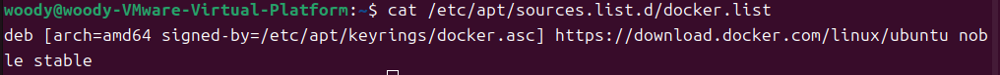
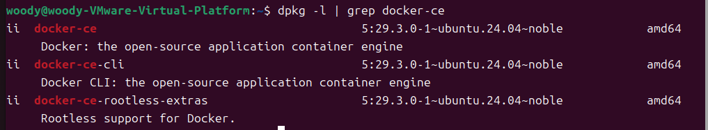
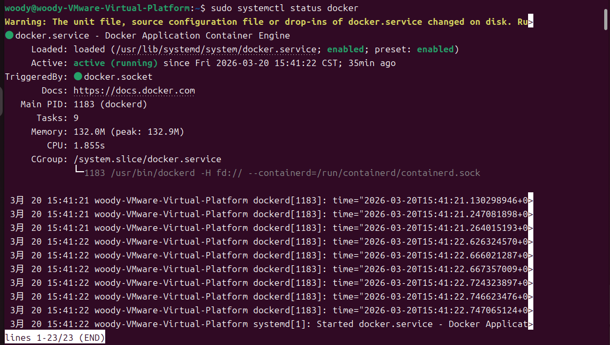
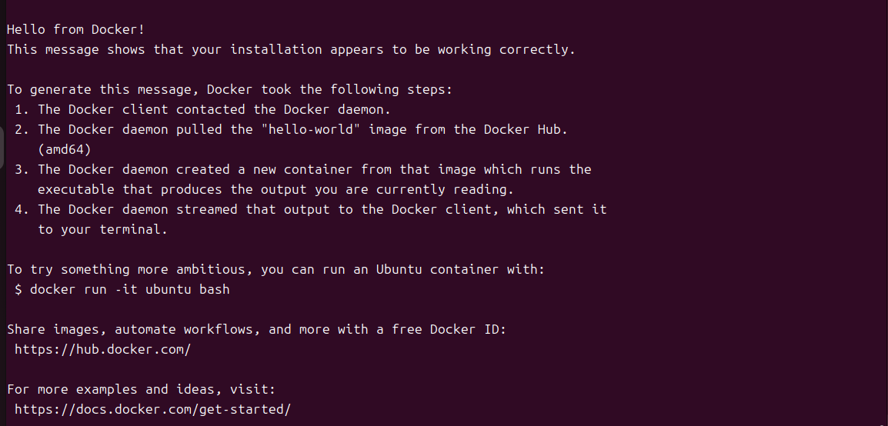
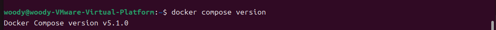
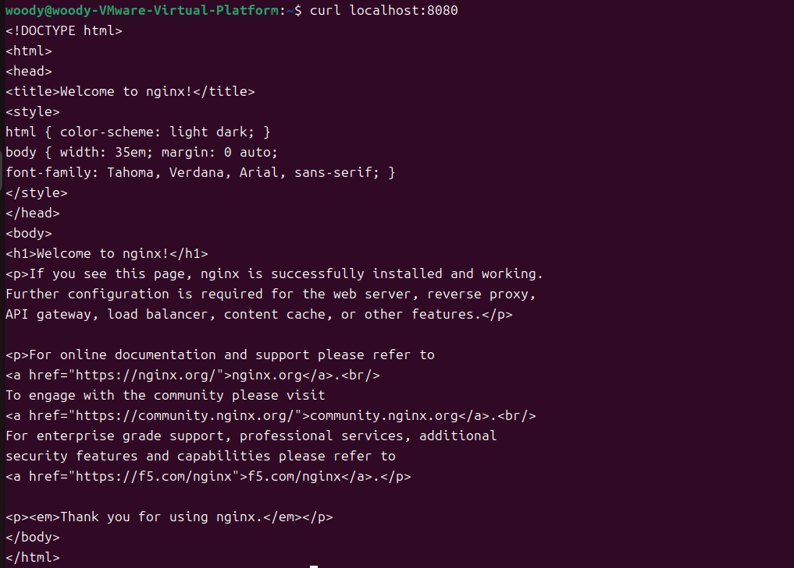
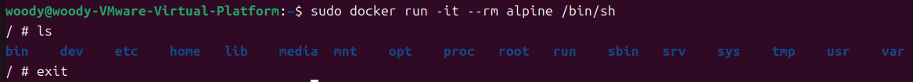
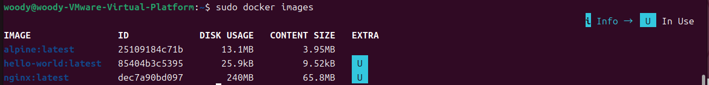

# W01｜虛擬化概論、環境建置與 Snapshot 機制

## 環境資訊
- Host OS：Windows 11
- VM 名稱：vct-w01-411631202
- Ubuntu 版本：Ubntu 24.04.4 LTS
- Docker 版本：Docker version 29.3.0, build 5927d80
- Docker Compose 版本：Docker Compose version v5.1.0

## VM 資源配置驗證

| 項目 | VMware 設定值 | VM 內命令 | VM 內輸出 |
|---|---|---|---|
| CPU | 2 vCPU | `lscpu \| grep "^CPU(s)"` | CPU(s): 2 |
| 記憶體 | 4 GB | `free -h \| grep Mem` | Mem:           6.7Gi       2.3Gi       1.5Gi        61Mi       3.0Gi       4.4Gi |
| 磁碟 | 40 GB | `df -h /` | 檔案系統        容量  已用  可用 已用% 掛載點/dev/sda2        40G   12G   26G   33%  |
| Hypervisor | VMware | `lscpu \| grep Hypervisor` | Hypervisor 供應商：VMware |

## 四層驗收證據
- [ ] ① Repository：`cat /etc/apt/sources.list.d/docker.list` 輸出

- [ ] ② Engine：`dpkg -l | grep docker-ce` 輸出

- [ ] ③ Daemon：`sudo systemctl status docker` 顯示 active

- [ ] ④ 端到端：`sudo docker run hello-world` 成功輸出

- [ ] Compose：`docker compose version` 可執行

## 容器操作紀錄
- [ ] nginx：`sudo docker run -d -p 8080:80 nginx` + `curl localhost:8080` 輸出

- [ ] alpine：`sudo docker run -it --rm alpine /bin/sh` 內部命令與輸出

- [ ] 映像列表：`sudo docker images` 輸出

## Snapshot 清單

| 名稱 | 建立時機 | 用途說明 | 建立前驗證 |
|---|---|---|---|
| clean-baseline | 2026-03-24 15:15 | 開發就緒狀態：確保 Docker 引擎穩定、基礎映像檔已備妥，隨時可進行新專案部署。 | 1. docker images 確認包含 nginx 與 alpine。2. sudo docker run --rm hello-world 成功。3. curl localhost:8080 回傳 Nginx 網頁原始碼。 |
| docker-ready | 2026-03-24 15:15 | Docker 開發就緒：已完成 Engine 安裝與基礎 Image 抓取，隨時可進行容器化專案部署。 | 1. docker run hello-world 成功。2. docker images 確認包含 nginx (240MB) 與 alpine (13.1MB)。 |

## 故障演練三階段對照

| 項目 | 故障前（基線） | 故障中（注入後） | 回復後 |
|---|---|---|---|
| docker.list 存在 | 是 | 否 | 是 (Snapshot 回復) |
| apt-cache policy 有候選版本 | 是 | 否 | 恢復正常 |
| docker 重裝可行 | 是 | 否 | 是 |
| hello-world 成功 | 是 | N/A | 是 |
| nginx curl 成功 | 是 | N/A | 是 |

## 手動修復 vs Snapshot 回復

| 面向 | 手動修復 | Snapshot 回復 |
|---|---|---|
| 所需時間 | 約 1~2 分鐘 | 約 15~30 秒 |
| 適用情境 | 確切知道錯誤原因且為微小配置改動時。 | 系統大範圍損毀、找不出故障原因時。 |
| 風險 | 人為錯誤風險：指令打錯或遺失關鍵設定。 | 資料回溯風險：快照點後的資料會全部遺失。 |

## Snapshot 保留策略
- 新增條件：執行具風險的系統更新（如 Kernel 升級）前。
- 刪除條件：新版本穩定運行超過 48 小時。建立更新的穩定節點時，刪除兩個版本前的舊節點（滾動式刪除）。

## 最小可重現命令鏈
#### 1. 注入故障 (更改副檔名使 apt 忽略)
sudo mv /etc/apt/sources.list.d/docker.list /etc/apt/sources.list.d/docker.list.broken
sudo apt update

#### 2. 驗證來源消失 (優先權從 500 變 100)
apt-cache policy docker-ce

#### 3. 手動修復 (回復原名並重新獲取清單)
sudo mv /etc/apt/sources.list.d/docker.list.broken /etc/apt/sources.list.d/docker.list
sudo apt update

## 排錯紀錄
- 症狀：執行 apt update 時，系統警告 Ignoring file 'docker.list.broken' 且無 Docker 更新源。
- 診斷：檢查 /etc/apt/sources.list.d/，確認檔案副檔名不符合 APT 讀取規範（需為 .list）。
- 修正：將檔案重新命名回 docker.list 或使用 VMware Snapshot 功能回滾至 docker-ready 狀態。
- 驗證：重跑 apt-cache policy 確認恢復 download.docker.com來源。

## 設計決策
在本週實作中選擇使用 Docker 官方 Repository。雖然 Ubuntu 內建的 snap 安裝更快速，但官方版提供的 Docker Engine 在與 docker-compose-plugin 整合時更具標準性，且能確保獲得最新的安全性修補（如本次實作的 24.04 noble 版本），對於未來部署複雜的容器化專案（如資料庫或大型 App）更具穩定性。