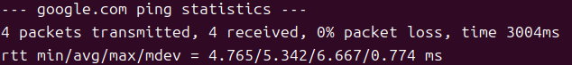
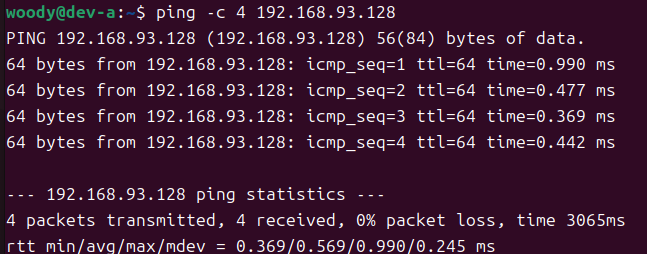
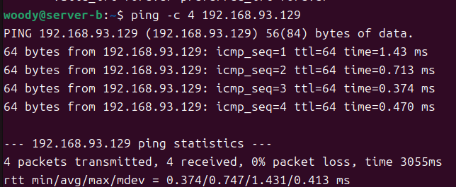
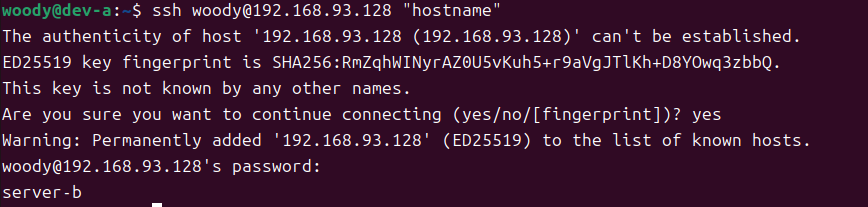
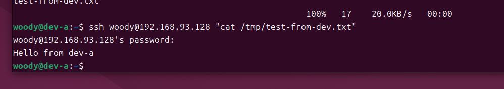
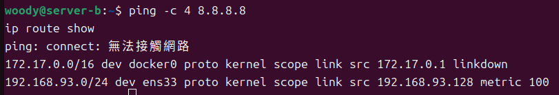
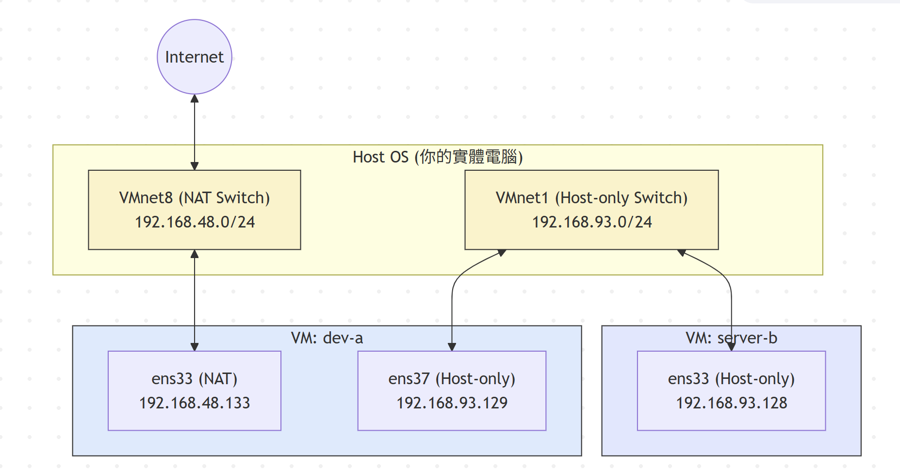

# W02｜VMware 網路模式與雙 VM 排錯

## 網路配置

| VM | 網卡 | 模式 | IP | 用途 |
|---|---|---|---|---|
| dev-a | NIC 1 | NAT | 192.168.48.133 | 上網 |
| dev-a | NIC 2 | Host-only | 192.168.93.129 | 內網互連 |
| server-b | NIC 1 | Host-only | 192.168.93.128 | 內網互連 |

## 連線驗證紀錄

- [ ] dev-a NAT 可上網：`ping google.com` 輸出
- [ ] 雙向互 ping 成功：貼上雙方 `ping` 輸出
- [ ] SSH 連線成功：`ssh <user>@<ip> "hostname"` 輸出
- [ ] SCP 傳檔成功：`cat /tmp/test-from-dev.txt` 在 server-b 上的輸出
- [ ] server-b 不能上網：`ping 8.8.8.8` 失敗輸出

## 故障演練一：介面停用S

| 項目 | 故障前 | 故障中 | 回復後 |
|---|---|---|---|
| server-b 介面狀態 | UP | DOWN | UP |
| dev-a ping server-b | 成功 | 失敗 | 成功 |
| dev-a SSH server-b | 成功 | 失敗 | 成功 |

## 故障演練二：SSH 服務停止

| 項目 | 故障前 | 故障中 | 回復後 |
|---|---|---|---|
| ss -tlnp grep :22 | 有監聽 | 無監聽 | 有監聽 |
| dev-a ping server-b | 成功 | 成功 | 成功 |
| dev-a SSH server-b | 成功 | Connection refused | 成功 |

## 排錯順序

### 1. L2 (Data Link Layer / 資料連結層)：檢查網卡介面狀態

步驟：首先確認虛擬機的網卡介面是否處於啟動 (UP) 狀態，有沒有拿到 MAC 位址。如果網卡本身是 DOWN 的狀態，上層的網路絕對不通。

使用命令：
* `ip address show` (檢查介面狀態與 IP 資訊)
* `ip link show` (專門查看 L2 介面狀態)

修復命令：`sudo ip link set <介面名稱> up`

---

### 2. L3 (Network Layer / 網路層)：檢查 IP 路由與連通性

步驟：確認網卡開啟且有 IP 後，檢查兩台機器之間的路由是否能互相抵達。這層的重點是「機器能不能找到另一台機器」。

使用命令：
* `ping -c 4 <目標 IP>` (利用 ICMP 封包測試網路層的連通性)
* `ip route show` (檢查路由表設定是否正確)

---

### 3. L4 (Transport Layer / 傳輸層)：檢查服務與 Port 監聽狀態

步驟：如果 ping 得到 (L3 正常)，但服務連不上 (例如 SSH 失敗顯示 Connection refused)，代表是目標機器的傳輸層通訊埠沒有開啟，或是服務本身當機了。

使用命令：
* `ss -tlnp | grep :22` (檢查本機的 SSH port 22 是否處於 LISTEN 監聽狀態)
* `ssh <user>@<IP>` (實際發起 TCP 連線測試應用服務)

修復命令：`sudo systemctl start ssh`
## 網路拓樸圖

## 排錯紀錄
* **症狀：** `dev-a` 無法透過 SSH 連線至 `server-b`，終端機顯示 `Connection refused` 錯誤。
* **診斷：**
    1. 首先使用 `ping 192.168.93.128` 檢查 L3 網路層，發現封包有正常回應，排除網卡或路由斷線問題。
    2. 接著推斷是 L4 傳輸層或應用服務異常。登入 `server-b` 使用 `ss -tlnp | grep :22` 檢查，發現 Port 22 沒有處於 `LISTEN`（監聽）狀態，確認是 SSH 服務未啟動或已停止。
* **修正：** 在 `server-b` 上執行 `sudo systemctl start ssh` 重新啟動 SSH 服務。
* **驗證：** 再次於 `server-b` 執行 `ss -tlnp | grep :22` 確認監聽已恢復，接著從 `dev-a` 執行 `ssh woody@192.168.93.128 "hostname"`，成功回傳 `server-b`，確認修復有效。
## 設計決策

**技術選擇：將 `server-b` 的網卡配置為僅限 `Host-only` 模式，不配置 `NAT` 或對外連線能力。**

* **取捨 (Trade-off) 分析：**
  * **犧牲的便利性：** `server-b` 無法直接連上網際網路，這意味著它不能自己使用 `apt update` 下載更新，或是用 `wget` 抓取外部資源。若需要任何外部檔案，必須先由 `dev-a` 下載後再透過 `scp` 傳入。
  * **換取的安全性：** 透過在 L2 (資料連結層) 物理性地切斷對外網路，我們大幅降低了 `server-b` 被外部網路掃描或惡意攻擊的風險。它完全被隱藏在一個私有的封閉網段中 (`192.168.93.0/24`)。

* **架構意義 (跳板機設計)：**
  這是一種實務上非常標準的「跳板機 (Bastion Host / Jump Server)」架構。我們讓擁有雙網卡的 `dev-a` 同時接觸外網與內網，扮演管理節點的角色。所有對 `server-b` 的管理（如 SSH 連線），都必須先合法登入 `dev-a` 後才能進行，確保了後端伺服器的絕對隱蔽與安全。