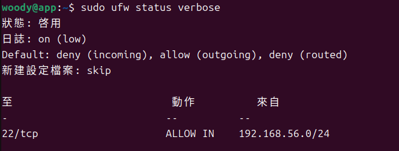
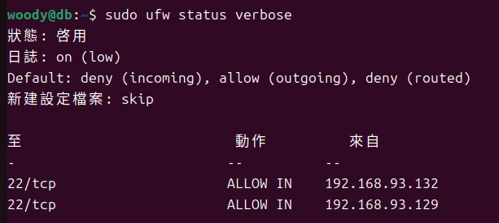
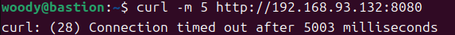
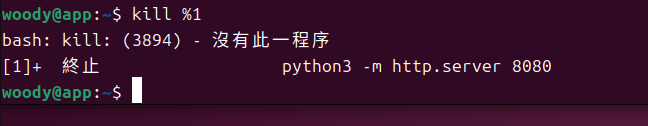
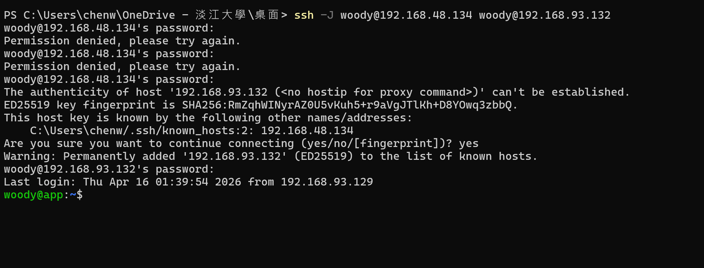
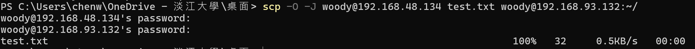
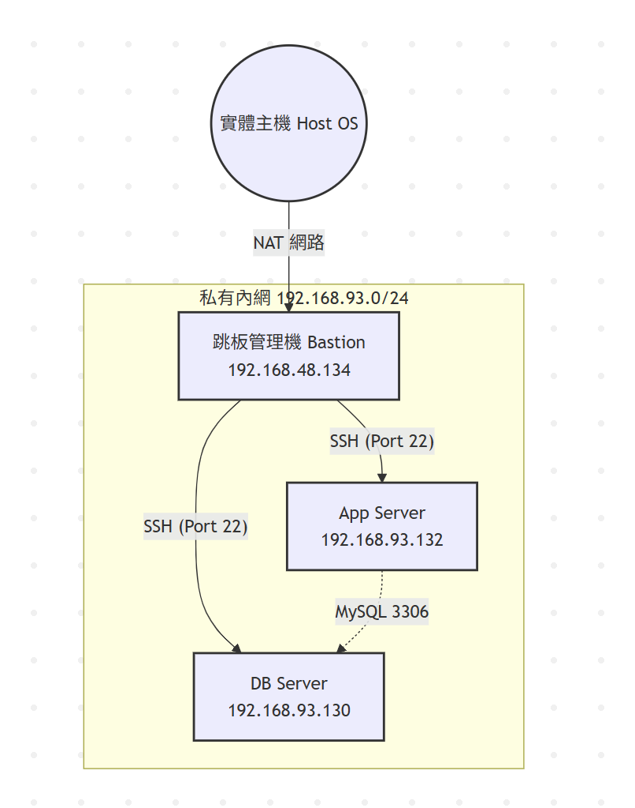

# W03｜多 VM 架構：分層管理與最小暴露設計

## 網路配置

| VM | 角色 | 網卡 | 模式 | IP | 開放埠與來源 |
|---|---|---|---|---|---|
| bastion | 跳板機 | NIC 1 | NAT | 192.168.48.134 | SSH from any |
| bastion | 跳板機 | NIC 2 | Host-only | 192.168.93.129 | — |
| app | 應用層 | NIC 1 | Host-only | 192.168.93.128 | SSH from 192.168.56.0/24 |
| db | 資料層 | NIC 1 | Host-only | 192.168.93.130 | SSH from app + bastion |

## SSH 金鑰認證

- 金鑰類型：ed25519
- 公鑰部署到：app 和 db 的 ~/.ssh/authorized_keys
- 免密碼登入驗證：
  - bastion → app：00:53:00 up 12 min, 1 user, load average: 0.00, 0.08, 0.12
  - bastion → db：00:55:06 up 6 min, 3 users, load average: 0.00, 0.11, 0.07

## 防火牆規則

### app 的 ufw status

### db 的 ufw status


### 防火牆確實在擋的證據


## ProxyJump 跳板連線
- 指令：
- 驗證輸出：
- SCP 傳檔驗證：

## 故障場景一：防火牆全封鎖

| 項目 | 故障前 | 故障中 | 回復後 |
|---|---|---|---|
| app ufw status | active + rules | deny all | active + rules |
| bastion ping app | 成功 | 成功 | 成功 |
| bastion SSH app | 成功 | **timed out** | 成功 |

## 故障場景二：SSH 服務停止

| 項目 | 故障前 | 故障中 | 回復後 |
|---|---|---|---|
| ss -tlnp grep :22 | 有監聽 | 無監聽 | 有監聽 |
| bastion ping app | 成功 | 成功 | 成功 |
| bastion SSH app | 成功 | **refused** | 成功 |

## timeout vs refused 差異
| 錯誤類型 | 生動比喻 | 排錯方向 |
| :--- | :--- | :--- |
| **Timed out (逾時)** | 像門口裝了**隱形盾牌**。訪客敲門時盾牌讓訪客直接消失且不回話，訪客等太久只能放棄。 | 優先檢查 **UFW 防火牆規則**、網路路由或雲端安全組設定。 |
| **Connection Refused (拒絕)** | 像家裡**門沒開**但**警衛在場**。訪客敲門時警衛立刻回覆「這間沒人在家」，訪客不必等。 | 檢查 **SSH 服務** 是否啟動 (`sudo systemctl status ssh`) 或監聽埠號。 |
## 網路拓樸圖


## 排錯紀錄
### **1. 症狀 (Symptom)**
* 從 **Bastion** 透過 SSH 連入 **App** 時，系統無回應並出現 `Connection timed out`。
* 進入 **App** 主機執行 `ip addr` 指令，發現內網網卡 (`ens37`) 未獲取到 `192.168.93.x` 網段的 IP。

### **2. 診斷 (Diagnostic)**
* **網卡狀態**：確認 `ens37` 網卡雖然硬體已掛載，但 DHCP 服務未自動分配地址。
* **安全規則**：確認 **UFW 防火牆** 已啟動，且其預設規則 (Default Deny) 擋住了所有來自內網段的初始化連線請求。

### **3. 修正 (Resolution)**
- [x] **手動獲取 IP**：執行 `sudo dhclient ens37` 重新索取內網位址。
- [x] **放行防火牆**：執行以下指令，精確授權內網段存取 SSH 服務：
  ```bash
  sudo ufw allow from 192.168.93.0/24 to any port 22
## 設計決策
### **技術選擇：為何 DB 允許 Bastion 直連，而非僅限 App 跳轉？**

1. **維運路徑的高可用性 (Management Availability)**
   * **決策**：若 DB 僅限透過 App 存取，當 App 伺服器因系統崩潰、磁碟滿載或 SSH 服務故障時，管理員將同步失去對資料庫的控制權。
   * **取捨**：保留 Bastion 直連 DB 的路徑，確保即使應用層 (App) 失效，仍有獨立的「管理隧道」進行維修與數據備份。

2. **最小權限原則與審計分離 (Separation of Concerns)**
   * **決策**：將「業務存取」與「管理存取」完全切分。
     * **App -> DB**：僅開放資料庫通訊埠 (如 MySQL 3306)，供程式讀取資料。
     * **Bastion -> DB**：僅開放遠端管理埠 (SSH 22)，供管理員維護系統。
   * **優勢**：當 App 遭到入侵時，駭客無法輕易透過 App 權限直接對 DB 進行系統級 (OS Level) 的破壞。

3. **安全防禦與暴露面控制 (Security vs. Exposure)**
   * **做法**：雖然多開了一個連入點，但透過 **UFW 防火牆** 嚴格鎖定來源 IP 為 Bastion 之內網位址 (`192.168.93.129`)。
   * **結論**：在嚴格的白名單管控下，此設計在不顯著增加攻擊面的前提下，極大提升了系統的維護彈性。

---