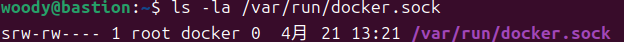
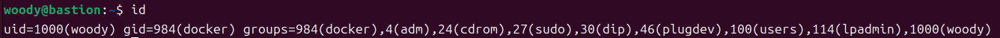
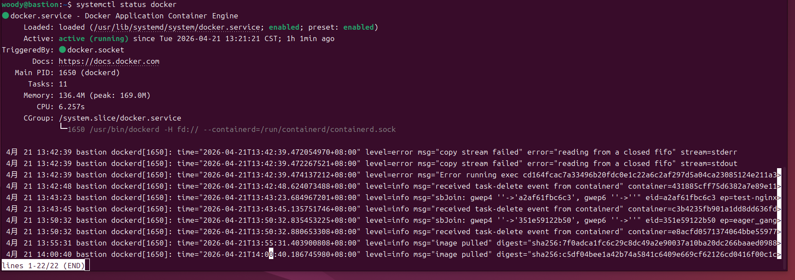

# W04｜Linux 系統基礎：檔案系統、權限、程序與服務管理

## FHS 路徑表

| FHS 路徑 | FHS 定義 | Docker 用途 |
|---|---|---|
| /etc/docker/ | 系統級設定檔目錄 | 存放 daemon.json（Docker 引擎的參數設定） |
| /var/lib/docker/ | 程式持久性狀態資料 | 存放 Images、Containers、Volumes 等核心資料 |
| /usr/bin/docker | 使用者可執行檔 | Docker CLI 工具 的執行檔位置 |
| /run/docker.sock | 執行期暫存 (Socket) | Docker Daemon 的通訊門戶 (Unix Socket) |

## Docker 系統資訊

- Storage Driver：overlayfs
- Docker Root Dir：/var/lib/docker
- 拉取映像前 /var/lib/docker/ 大小：14G
- 拉取映像後 /var/lib/docker/ 大小：15G

## 權限結構

### Docker Socket 權限解讀

* **`s`**: 代表這是一個 **Socket 檔案**。
* **`rw-` (Owner: root)**: root 使用者具備完全讀寫權限。
* **`rw-` (Group: docker)**: **docker 群組成員**具備讀寫權限，因此加入此群組的使用者無需 `sudo` 即可執行指令。
* **`---` (Others)**: 其他不屬於 docker 群組的使用者無權存取，確保系統安全。
### 使用者群組

* **指令**：`id`
* **結果**：輸出結果顯示 `groups` 欄位中已包含 **`984(docker)`**。
* **驗證**：這代表目前的使用者 `woody` 已經正式具備與 **Docker Socket (`/var/run/docker.sock`)** 通訊的權限。
### 安全意涵
在 Linux 權限模型中，`docker` 群組的權限看似只針對 Docker 指令，但實務上其危險性等同於擁有 `root` 帳號。

#### **安全示範觀察結果**
我執行了以下指令進行測試：
`docker run --rm -v /:/host alpine cat /host/etc/shadow`

* **觀察到的現象**：即便我目前的身份是普通使用者 `woody`，但我卻能透過 Docker 容器掛載宿主機的根目錄 (`/`)，進而讀取到系統中保護最嚴密的 `/etc/shadow`（使用者密碼雜湊檔）。
* **結論**：普通使用者在正常情況下無法讀取此檔案，但透過 Docker 繞過了這層保護。

#### **為什麼 docker group ≈ root？**
1.  **Daemon 權限高度整合**：Docker Daemon 是以 `root` 身份在背景運作的。
2.  **指令權限轉移**：當使用者加入 `docker` 群組後，就獲得了對 Docker Daemon 的控制權。這意味著使用者可以命令「具備 root 權限的 Daemon」去做任何事。
3.  **任意掛載能力**：只要能操作 Docker，就能將宿主機的任何目錄（包括 `/etc`、`/root`、`/home`）掛載進容器。在容器內部，這些檔案對 Docker 來說是完全透明且可讀寫的。
## 程序與服務管理

### systemctl status docker

### journalctl 日誌分析
在 Linux 系統中，當服務運作異常時，第一步就是檢視系統日誌。我使用 `journalctl` 工具觀察 Docker 的運行軌跡。

#### 日誌觀察
* **指令**: `journalctl -u docker --since "1 hour ago"`
* **觀察結果**: 
    * **映像檔操作**: 日誌清楚記錄了 `image pulled` 事件，對應到下載 mysql 的時間點。
    * **除錯紀錄**: 成功捕捉到先前因容器內缺乏指令而導致的 `Error running exec` 報錯，證實了系統日誌對於故障排除 (Troubleshooting) 的價值。

### CLI vs Daemon 差異
####  角色定義
* **CLI (docker)**: 使用者操作的介面，位於 `/usr/bin/docker`，負責發送請求。
* **Daemon (dockerd)**: 背景運作的系統服務，由 `systemd` 管理，負責實際操作容器資源。
## 環境變數

- $PATH：/usr/local/sbin:/usr/local/bin:/usr/sbin:/usr/bin:/sbin:/bin:/usr/games:/usr/local/games:/snap/bin:/snap/bin
- which docker：/usr/bin/docker
### 容器內外環境變數差異觀察：
### 1. 實作觀察紀錄
* **指令**：`echo $PATH` (宿主機) 與 `docker run --rm alpine env | grep PATH` (容器內)
* **宿主機 (Bastion)**：`$PATH` 包含 `/usr/games`、`/snap/bin` 等較多樣的路徑，反映了完整作業系統的複雜度與豐富的預裝工具。
* **容器內 (Alpine/Nginx)**：`$PATH` 極其精簡，僅保留基礎路徑如 `/usr/local/sbin:/usr/local/bin:/usr/sbin:/usr/bin:/sbin:/bin`。

### 2. 結論與核心意涵

#### **A. 環境隔離性 (Environment Isolation)**
容器並不繼承宿主機的環境變數。這確保了應用程式在不同機器或開發環境中執行時，行為能保持高度一致，不會因為宿主機額外安裝的工具或路徑設定而產生副作用。

#### **B. 極簡化原則 (Minimalism for Security)**
容器映像檔為了輕量化與減少攻擊面 (Attack Surface)，僅提供執行該應用所需的最基礎路徑。這解釋了為何在容器內執行宿主機工具（如 `snap` 或特定的系統管理命令）會出現 `command not found`。

#### **C. 指令搜尋邏輯 (Path Priority)**
Linux 系統會由左至右依序搜尋 `$PATH` 中的目錄。當執行 `docker` 指令時，系統在 `/usr/bin/` 找到對應檔案後便停止搜尋並執行。理解此邏輯有助於未來排查指令衝突或版本覆蓋的問題。
## 故障場景一：停止 Docker Daemon

| 項目 | 故障前 | 故障中 | 回復後 |
|---|---|---|---|
| systemctl status docker | active | inactive (dead) | active (running) |
| docker --version | 正常 |正常 (不依賴 Daemon) | 正常 |
| docker ps | 正常 | Cannot connect | 正常 |
| ps aux grep dockerd | 有 process | 無 process (背景程序已結束) | 有 process |

## 故障場景二：破壞 Socket 權限

| 項目 | 故障前 | 故障中 | 回復後 |
|---|---|---|---|
| ls -la docker.sock 權限 | srw-rw---- | srw------- | srw-rw---- |
| docker ps（不加 sudo） | 正常 | permission denied | 正常 |
| sudo docker ps | 正常 | 正常 (root 不受 600 限制) | 正常 |
| systemctl status docker | active | active (running) | active (running) |

## 錯誤訊息比較

| 錯誤訊息 | 根因 | 診斷方向 |
|---|---|---|
| Cannot connect to the Docker daemon | 服務 (Service) 未啟動。Docker Daemon (dockerd) 沒有在背景運行。 | 檢查服務狀態：systemctl status docker；嘗試啟動：sudo systemctl start docker。 |
| permission denied…docker.sock | 權限不足。使用者不在 docker 群組，或 Socket 檔案權限被修改。 | 檢查群組：id；檢查 Socket 權限：ls -la /run/docker.sock；或加上 sudo 執行。 |
#### **1. 「連不上」(Cannot connect)**
* **本質**：通訊對象不存在。
* **排錯方向**：這屬於 **「服務管理」** 層次的問題。我應該檢查背景程序是否崩潰或被停止。就像你想打電話，但對方的手機關機了。
* **常用工具**：`systemctl`, `journalctl`, `ps aux`。

#### **2. 「被拒絕」(Permission denied)**
* **本質**：通訊對象在，但不讓你說話。
* **排錯方向**：這屬於 **「系統安全性與權限」** 層次的問題。服務運作正常，但 Linux 的檔案保護機制擋住了你的存取。就像對方手機開著，但你的號碼被黑名單了。
* **常用工具**：`ls -la`, `chmod`, `id`, `usermod`。

## 排錯紀錄
* **症狀 (Symptom)**：
    執行 `docker ps` 時噴出 `permission denied` 錯誤，無法存取 Docker API 進行通訊。
* **診斷 (Diagnosis)**：
    1.  檢查通訊管道：`ls -la /var/run/docker.sock`，確認該 Socket 檔案的 Group 為 `docker` 且權限為 `rw`。
    2.  檢查身份：執行 `id` 指令，發現目前使用者 `woody` 並不在 `docker` 群組清單中。
* **修正 (Remediation)**：
    1.  **提權授權**：執行 `sudo usermod -aG docker $USER`。
    2.  **即時生效**：執行 `newgrp docker` 強制更新當前 Shell Session 的群組身份，避免需要登出再登入。
* **驗證 (Verification)**：
    再次執行 `docker ps`，系統已能正常回傳容器列表，證實權限設定成功。

## 設計決策
### 技術選擇與取捨：`sudo docker` vs `docker group`

本週實驗中，我選擇了 **「將使用者加入 docker 群組」** 的方案，而非每次手動提權。

#### **💡 取捨理由與取向：**
* **安全性 (Security)**：
    雖然將使用者加入群組存在潛在的提權風險（docker group 成員實質上等同擁有 `root` 權限，可透過掛載 Host 根目錄讀取敏感資料），但在開發與學習階段，安全風險在可控範圍內。
* **操作體驗 (UX)**：
    此舉大幅提升了操作流暢度，避免頻繁輸入密碼中斷思路。
* **穩定性 (Stability)**：
    減少使用 `sudo` 執行 Docker 指令，能有效避免因 `root` 身份導致的環境變數 (`$PATH`, `$HOME`) 錯亂或產生的檔案權限問題。