# 期末實作 — 411631202 陳威伍

## 1. 架構總覽

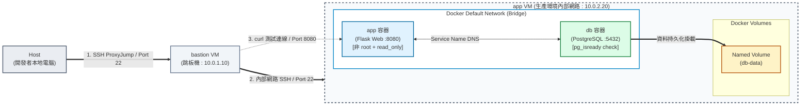

**架構技術說明：**
本專案採用安全雙層跳板與最小權限微服務架構。外部連線必須經由 `bastion VM` 進行 SSH ProxyJump 認證才能進入 `app VM`。容器環境由 Docker Compose 管理，`app` 容器已全面鎖死權限（非 root、唯讀檔案系統、丟棄核心特權），並與 `db` 容器建立強依賴啟動順序。資料庫數據則掛載於獨立的 Named Volume 確保資料持久化。

## 2. Part A：底座與基準點
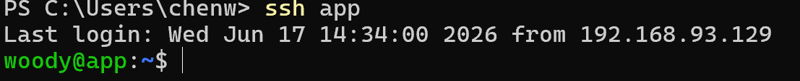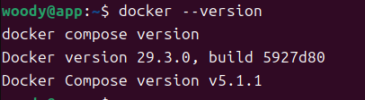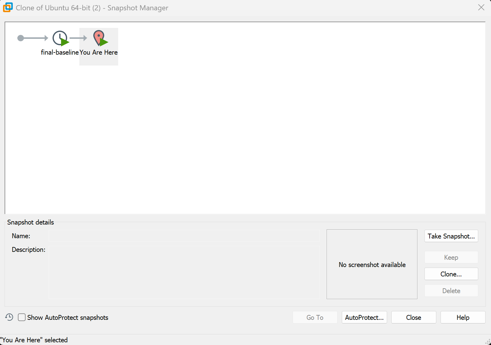

## 3. Part B : Dockerfile 與快取

**Dockerfile 內容：**
```dockerfile
# 使用輕量級的 Python 基底映像檔
FROM python:3.10-slim

# 建立非 root 使用者 (名稱隨意，這裡叫 appuser)
RUN useradd -m appuser

# 設定工作目錄
WORKDIR /app

# 【快取原則 1】先複製 requirements.txt 並安裝依賴
# 因為套件不常變動，這樣這層就可以被快取 (CACHED)
COPY requirements.txt .
RUN pip install --no-cache-dir -r requirements.txt

# 【快取原則 2】再複製程式碼
# 因為 app.py 變動最頻繁，放最後面才不會讓前面的快取失效
COPY app.py .

# 將檔案擁有者改為剛剛建立的非 root 使用者
RUN chown -R appuser:appuser /app

# 【資安原則】切換到非 root 使用者
USER appuser

# 【啟動原則】使用 exec form 啟動應用程式
CMD ["python", "app.py"]
```
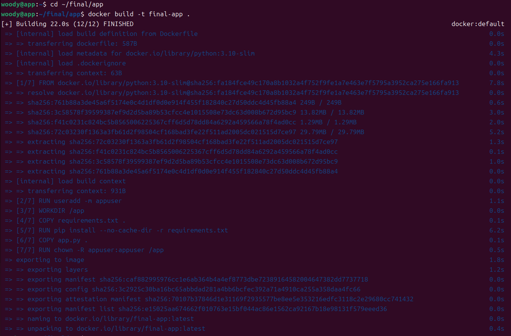
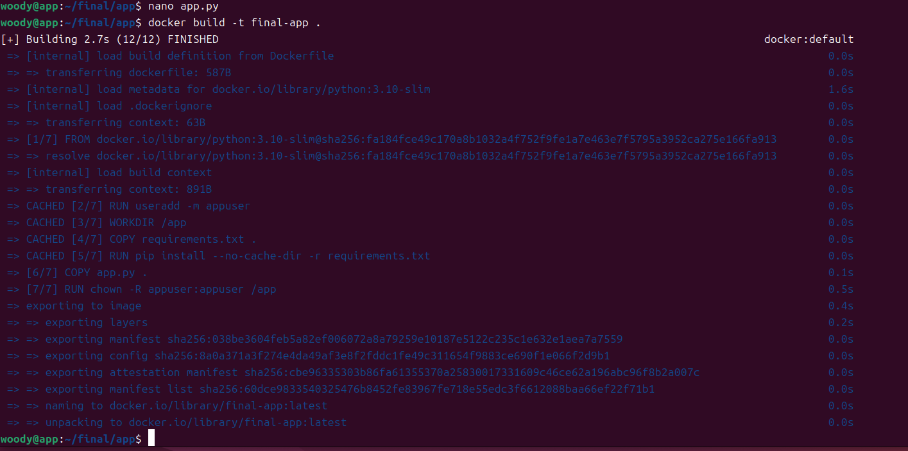
## 為什麼聽 8080 不聽 80？
因為在 Linux 系統的權限模型中，0 到 1023 的連接埠（Port）屬於「特權埠 (Privileged Ports)」，必須要有 root 權限才能綁定。為了符合資安最小權限原則，本專案的 Dockerfile 使用了 USER appuser 指令切換為非 root 執行，因此若強行綁定 port 80 會發生 Permission denied 錯誤。改為監聽大於 1023 的 port 8080，應用程式就能以非特權身分安全且正常地啟動。

## 4. Part C : Compose 與資料持久化

**Compose.yaml 設定重點：**
本專案的 `compose.yaml` 實作了以下生產環境級別的防護：
1. **資料持久化**：使用 Named Volume (`db-data:/var/lib/postgresql/data`)，確保容器刪除後資料不遺失。
2. **啟動順序**：透過 `depends_on` 與 `condition: service_healthy`，確保 App 必須等到 DB 完全就緒且通過健康檢查後才啟動，避免連線失敗。
3. **唯讀與降權防護**：App 容器設定了 `read_only: true`（唯讀檔案系統）與 `cap_drop: ALL`（拔除所有核心特權），落實最小權限原則。

**三段對照實驗（證明資料持久化）：**

1. **第一段（正常啟動與驗證）**：
   確認雙服務皆達到 `healthy` 狀態，且 App 能夠正常回傳資料庫時間。
   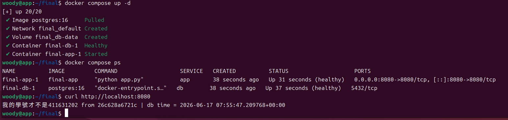

2. **第二段（破壞性重置）**：
   使用 `docker compose down` 刪除所有容器與網路。可以觀察到雖然容器被移除了，但 Named Volume 被安全保留。
   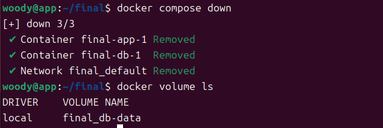

3. **第三段（重建與資料確認）**：
   再次 `docker compose up -d`。由於資料卷仍存在，資料庫不需要重新初始化，App 也能立刻重啟並讀取到舊有的底層資料。
   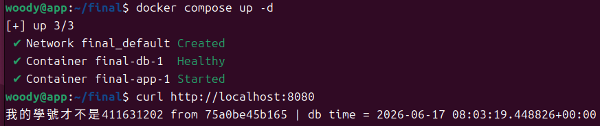
## 5. Part D : 生產化加固

**權限驗證輸出：**
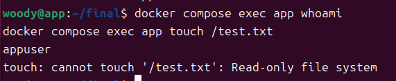

**cgroup 讀值輸出：**
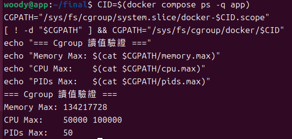

### yaml 的值怎麼對回 cgroup 檔案？
Docker 會將 `compose.yaml` 中的設定值轉譯並寫入 Linux 核心的 cgroup v2 控制檔中，對應關係與換算如下：

1. **記憶體 (`mem_limit: 128m`) ➔ `memory.max`**
   - YAML 設定的 128MB，會被轉換為 bytes 寫入檔案。
   - 計算：$128 \times 1024 \times 1024 = 134217728$ bytes。
2. **CPU (`cpus: 0.5`) ➔ `cpu.max`**
   - cgroup v2 中使用 `quota period` 的格式來表示。0.5 顆 CPU 代表在一個週期（預設 100000 毫秒）內，最多只能使用 50000 毫秒的運算量。
   - 檔案內容會顯示為：`50000 100000`。
3. **行程數量 (`pids_limit: 50`) ➔ `pids.max`**
   - 這是防止 Fork Bomb 的防護，YAML 設定的 50 會直接寫入 `pids.max` 中，代表該容器最多只能產生 50 個 process/thread。
## 6. Part E : 故障演練

### 故障 1：<模擬 F1：後端資料庫無預警停機>

* **注入方式：** 執行 `docker compose stop db` 強制關閉資料庫容器。
* **故障前：** 執行 `curl http://localhost:8080`，正常回傳學號與資料庫時間。
  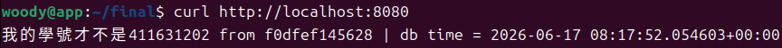
* **故障中：** 執行 `curl http://localhost:8080/healthz` 或打首頁，畫面顯示 `db unreachable...` (HTTP 503)。
  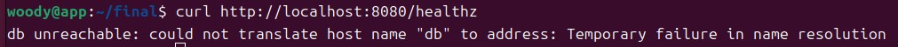
* **回復後：** 執行 `docker compose start db` 重啟資料庫，再次 `curl` 恢復正常連線與時間讀取。
  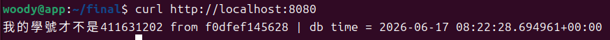
* **診斷推論：** 當 DB 停機時，App 容器仍然存活且主機 8080 port 仍有監聽，因此連線能成功建立。但在執行程式碼內的 SQL 查詢時發生連線失敗，依照 `app.py` 的邏輯捕獲 Exception 並回傳了 HTTP 503 狀態碼。這證實了 503 屬於「應用程式層」的邏輯報錯。

---

### 故障 2：<模擬 F2：應用程式服務器崩潰>

* **注入方式：** 執行 `docker compose stop app` 強制關閉 App 容器。
* **故障前：** 執行 `curl http://localhost:8080`，正常回傳學號與資料庫時間。
  
* **故障中：** 執行 `curl http://localhost:8080`，終端機立刻報錯 `curl: (7) Failed to connect to localhost port 8080... Connection refused`。
  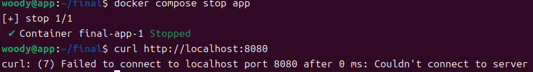
* **回復後：** 執行 `docker compose start app` 重啟應用程式，再次 `curl` 恢復正常。
  
* **診斷推論：** 當 App 容器停止運作，主機的 8080 port 不再有任何 Process 監聽。此時作業系統的網路層在收到 `curl` 發出的 TCP SYN 封包時，發現該 port 查無服務，於是立刻回傳 RST 封包直接拒絕連線。這證實了 Connection Refused 屬於「系統服務層」的錯誤。

---

### 三症狀分層表（必答）

| 症狀 | 最可能的層 | 第一條驗證命令 |
| :--- | :--- | :--- |
| timeout | 網路層 / 防火牆層 (Network Layer) | `sudo ufw status` (檢查防火牆是否阻擋) |
| connection refused | 系統服務層 (OS / Service Layer) | `docker compose ps` (檢查容器/服務是否存活) |
| HTTP 503 | 應用程式層 (Application Layer) | `docker compose logs app` (檢查程式碼報錯日誌) |

## 7. 反思 (200 字)

這四種「隔離」雖然概念相似，但在防禦的維度與目標上截然不同，彼此構築出層層疊疊的深度防禦網。

**VM 的隔離**是基於硬體與作業系統層級的物理藩籬，防範的是「系統級崩潰」，確保單一機器的致命錯誤不會波及宿主機。進入容器環境後，**Namespace** 提供的是「視角與邊界」的隔離，限制服務只能看見專屬的網路與 PID，防範的是「水平互相干擾與窺探」。

**Cgroup** 則是針對實體運算資源的隔離，嚴格限制 CPU、記憶體與行程數，防範的是「資源霸佔與惡意耗盡（如 Fork Bomb 或 Noisy Neighbor）」。最後，**權限階梯**（如非 root 使用者、唯讀檔案系統、cap_drop）是資安防線的最後底牌，防禦的是「應用程式被攻破後的特權擴張與系統破壞」。

從底層硬體、視野邊界、資源分配到資安特權，它們防的東西都不一樣，卻又相輔相成。這讓我深刻體會到，真正的 Production-ready 從來不是單靠一項技術，而是步步為營、實踐最小權限原則的防禦藝術。

## 8. Bonus（選做）