# 期中實作 — 411631202 陳威伍

## 1. 架構與 IP 表

### 網路架構圖
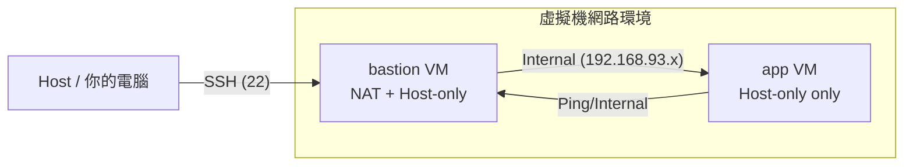
| VM Name | Interface | Type | IP Address | 備註 |
| :--- | :--- | :--- | :--- | :--- |
| **bastion** | ens33 | NAT | `192.168.48.134` | 用於連向外網 / 被 Host 連線 |
| **bastion** | ens37 | Host-only | `192.168.93.129` | 內網 IP，用於連向 app |
| **app** | ens33 | Host-only | `192.168.93.128` | 內網服務機器 |
## 2. Part A：VM 與網路

### 2.1 網路連通性驗證 (Ping 測試)
驗證兩台虛擬機在內網 (Host-only) 環境下是否能互相通訊：

* **從 bastion ping app (192.168.93.128)：**
    ```bash
    ping -c 4 192.168.93.128
    ```
    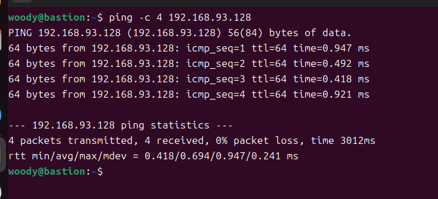

* **從 app ping bastion (192.168.93.129)：**
    ```bash
    ping -c 4 192.168.93.129
    ```
    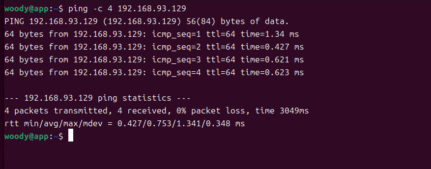

### 2.2 網卡配置狀態
執行 `ip -4 addr show` 確認網卡與 IP 獲取狀況：

* **Bastion:** * `ens33`: 192.168.48.134 (NAT)
    * `ens37`: 192.168.93.129 (Host-only)
* **App:** * `ens33`: 192.168.93.128 (Host-only)

## 3. Part B：金鑰、ufw、ProxyJump
### 3.1 防火牆規則表
| VM Name | UFW 規則摘要 (Status) | 目的 |
| :--- | :--- | :--- |
| **bastion** | `22/tcp ALLOW Anywhere` | 允許外部 Host 管理連線 |
| **app** | `22/tcp ALLOW 192.168.93.129` | **安全性增強**：僅限跳板機 SSH 連入 |

### 3.2 驗證證據
* **SSH ProxyJump 成功登入**：透過 `ssh app` 指令穿透跳板機成功登入。
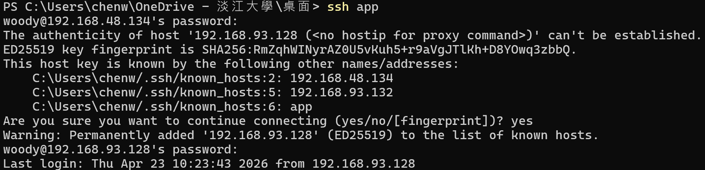
* **App UFW 詳細規則**：執行 `sudo ufw status verbose` 之結果。
 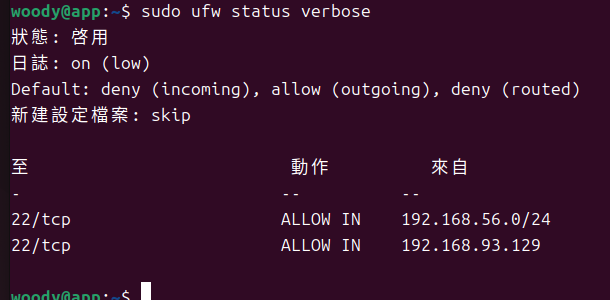
## 4. Part C：Docker 服務

### 4.1 容器部署與連線驗證
- **容器狀態**：已啟動 Nginx 容器，並將容器內 80 埠映射至 VM 主機 8080 埠。
 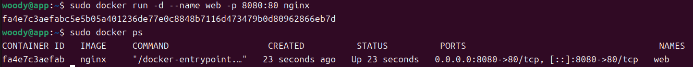
- **連線驗證**：從 **bastion** 執行 `curl -I` 存取 **app:8080**。
  - **結果**：成功獲取 `HTTP/1.1 200 OK`。
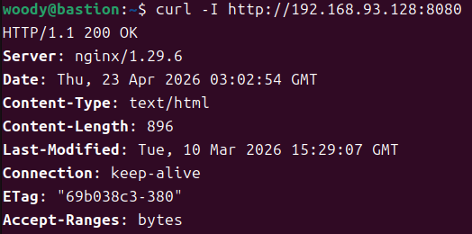

## 5. Part D：故障演練 (Failure Injection)

### 5.1 故障 1：F3 服務故障 (Docker Service)
- **注入方式**：於 app VM 執行 `sudo systemctl stop docker`。
- **故障前**：服務正常，curl 取得 200 OK。
- **故障中**：由於 Docker 停止，curl 顯示 `Failed to connect`。 
  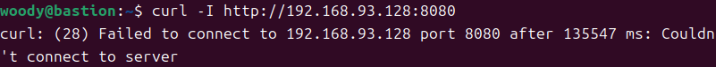
- **回復後**：重啟 Docker 與容器後，連線回復正常。 
  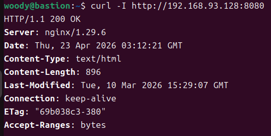

### 5.2 故障 2：F1 網路故障 (網卡失效)
- **注入方式**：將 app VM 的 Host-only 網卡 (ens33) 設為 down。
- **故障前**：Bastion 可正常 ping 通 app。
- **故障中**：網路中斷，Ping 顯示 `Destination Host Unreachable`。 
  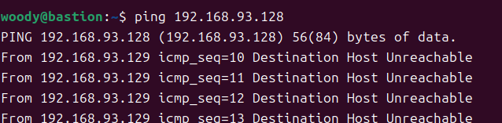
- **回復後**：將網卡設為 up，通訊立即恢復。 
  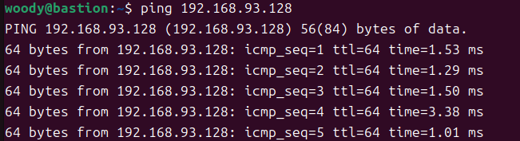
## 6. 技術反思與心得

這次實作讓我深刻體會到**「分層隔離 (Layered Isolation)」**在資安上的必要性。以前覺得連線只要通就好，但透過建立 Bastion 與 App 的二層架構，我理解到將核心服務藏在私有網段、並限制只有跳板機能連入，能極大化減少攻擊面。

而在故障演練中，我學到**「Timeout 不等於服務徹底壞了」**。當我下 F1 指令關閉網卡時，curl 出現的是完全沒回應的 Timeout；但執行 F3 關閉 Docker 服務時，則是噴出 Connection Refused。這讓我明白，從錯誤訊息的細微差別，就能判斷問題是出在「網路層」還是「應用層」。這種「有層次的故障」觀察，更能幫助我快速定位維運現場的問題。